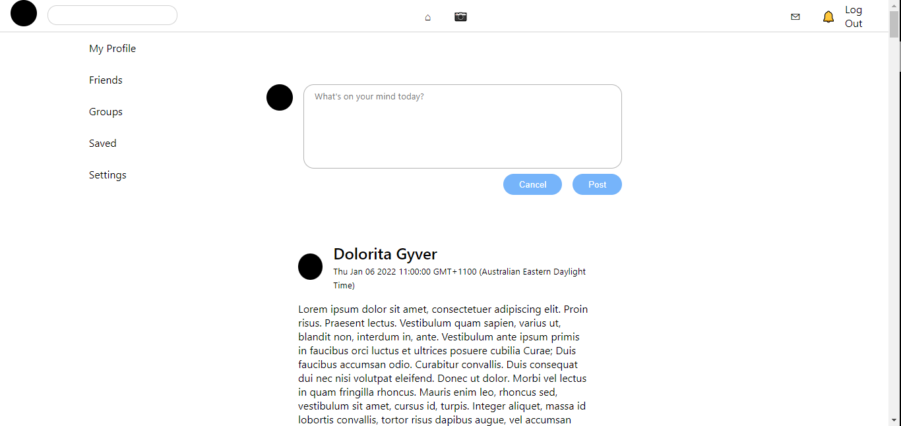
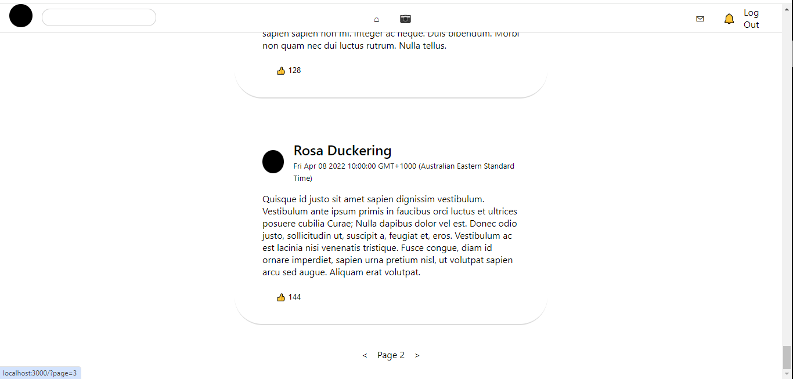
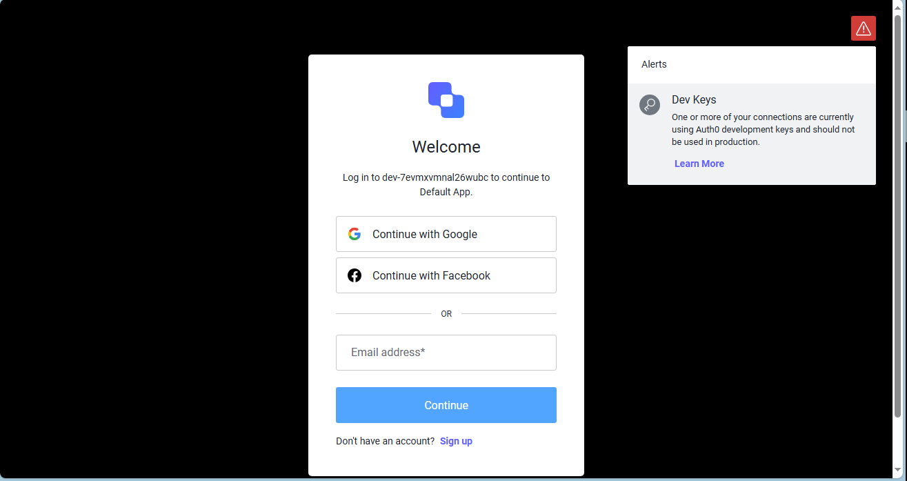

This is a [Next.js](https://nextjs.org/) project bootstrapped with [`create-next-app`](https://github.com/vercel/next.js/tree/canary/packages/create-next-app).

## Project Preview

## Overview

This is a simple social media app with minimalistic front-end. The following tools/frameworks were used:

- NextJS
- React
- Auth0 to provide authentication
- Prisma ORM
- MySQL
- CSS Modules

## Features

- Fully functional sign-ins/sign-ups
- Functional post uploading
- Feed is fetched from MySQL database
